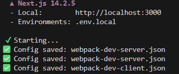
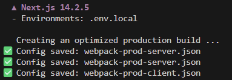
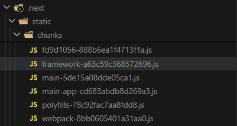
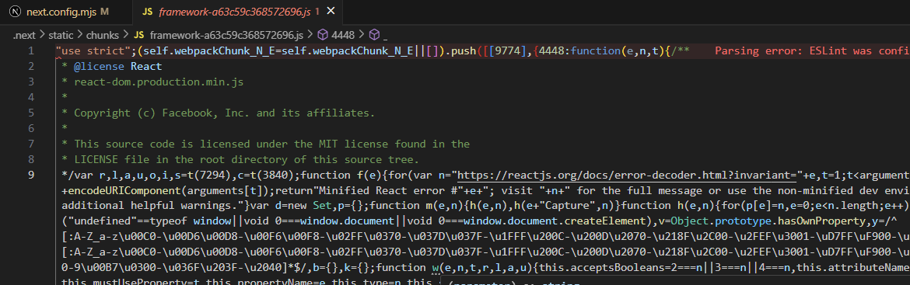

나는 주로 Next.js를 사용하고 있기 때문에, Next.js에서 webpack 최적화를 진행해보려고 했다.

Next.js는 Webpack을 내부적으로 사용하지만, `webpack.config.js` 파일은 따로 없다. 대신 `next.config.js` (또는 `next.config.mjs`) 파일에서 Webpack 설정을 커스터마이징할 수 있다. ([공식 문서](https://nextjs.org/docs/app/api-reference/config/next-config-js/webpack))

그런데 Next.js의 `next.config.mjs`에서 Webpack 설정으로 직접 빌드 용량 최적화를 하는 경우는 드물다고 한다. 왜냐하면 **Next.js가 이미 Webpack의 대부분의 최적화 옵션을 자동으로 활성화**하기 때문이다.

<br/>

# 내부 Webpack 설정 살펴보기

그렇다면 Next.js는 내부적으로 Webpack을 어떤 옵션으로 사용하고 있을까? 아래 코드로 config를 출력해보았다.

```tsx
import { writeFileSync } from 'fs';

/** @type {import('next').NextConfig} */
const nextConfig = {
  webpack: (config, { isServer, dev }) => {
    const fileName = `webpack-${dev ? 'dev' : 'prod'}-${isServer ? 'server' : 'client'}.json`;

		// BigInt 타입 stringify 에러 방지
    const configJson = JSON.stringify(
      config,
      (_key, value) => {
        return typeof value === 'bigint' ? value.toString() : value;
      },
      2,
    );

    writeFileSync(fileName, configJson);
    console.log(`✅ Config saved: ${fileName}`);
	
		return config;
  }
};

export default nextConfig;

```

로컬 서버를 실행시키면 바로 `webpack-dev-server.json`과 `webpack-dev-client.json` 파일이 생성된다.



<br/>

## 개발 모드 vs 프로덕션 모드

### 개발 모드

`webpack-dev-client.json` 파일의 일부이다. 이제 진짜 webpack 속성들이 보인다.

```json
{
  "externals": [
    "next"
  ],
  "optimization": {
    "emitOnErrors": false,
    "checkWasmTypes": false,
    "nodeEnv": false,
    **"splitChunks": false,**
    "runtimeChunk": {
      "name": "webpack"
    },
    **"minimize": false,**
    "minimizer": [
      null,
      null
    ],
    "usedExports": false
  },
  "context": "C:\\Users\\cyoob\\Desktop\\workspace\\board-buddy-front-end",
  "watchOptions": {
    "aggregateTimeout": 5,
    "ignored": {}
  },
  "output": {
    "publicPath": "/_next/",
    "path": "C:\\Users\\cyoob\\Desktop\\workspace\\board-buddy-front-end\\.next",
    "filename": "static/chunks/[name].js",
    "library": "_N_E",
    "libraryTarget": "assign",
    "hotUpdateChunkFilename": "static/webpack/[id].[fullhash].hot-update.js",
    "hotUpdateMainFilename": "static/webpack/[fullhash].[runtime].hot-update.json",
    "chunkFilename": "static/chunks/[name].js",
    "strictModuleExceptionHandling": true,
    "webassemblyModuleFilename": "static/wasm/[modulehash].wasm",
	  // 이하 생략
```

그래서 이전에 Webpack 최적화 전략에서 본 적 있었던 `optimization.splitChuk` 설정을 찾아보았으나 `false`이고, `entry` 포인트도 찾을 수 없었다. 그 외의 `minimize`도 모두 null로 설정되어 있어서 당황스러웠다.

일단 Entry 포인트가 지정되지 않은 이유는, **Next.js가 파일 시스템 기반 라우팅을 사용해서 webpack 설정을 동적으로 생성**하기 때문이다. 특히 개발 환경에서는 HMR(Hot Module Replacement)를 위한 추가 entry, 각 페이지별로 필요할 때 생성되는 entry, 개발 전용 entry 등 수많은 entry가 동적으로 생성된다고 한다.

그리고 splitChunkgs가 false인 이유는 Next.js가 개발 환경에서는 의도적으로 청크 분할을 비활성화하기 때문이었다. 이유는 다음과 같다.

- **빠른 빌드**: 청크 분할하면 빌드가 더 오래 걸림
- **간단한 디버깅**: 하나의 큰 번들이 디버깅하기 더 쉬움
- **HMR 최적화**: HMR에 더 효율적

<br/>

### 프로덕션 모드

그래서 바로 빌드해서 확인해보았다.



`webpack-prod-client.json` 파일의 optimization 설정 부분이다. 개발 모드와는 설정이 확연히 다른 것을 볼 수 있었다.

```json
  "optimization": {
    "emitOnErrors": true,
    "checkWasmTypes": false,
    "nodeEnv": false,
    "splitChunks": {
      "cacheGroups": {
        "framework": {
          "chunks": "all",
          "name": "framework",
          "priority": 40,
          "enforce": true
        },
        "lib": {
          "priority": 30,
          "minChunks": 1,
          "reuseExistingChunk": true
        }
      },
      "maxInitialRequests": 25,
      "minSize": 20000
    },
    "runtimeChunk": {
      "name": "webpack"
    },
    "minimize": true,
    "minimizer": [
      null,
      null
    ]
  },
```

<br/>

## SplitChunks

먼저, SplitChunks 부분을 조금 더 자세히 보면 다음과 같다.

```json
"splitChunks": {
	// 청크 분할 전략 설정
  "cacheGroups": {  // 청크 그룹 규칙들
    "framework": {
      "chunks": "all",  // 모든 청크 타입에 적용
      "name": "framework",  // 생성될 청크 이름
      "priority": 40,  // 우선순위 (높을수록 먼저 처리)
      "enforce": true  // 다른 조건 무시하고 강제로 분할
    },
    "lib": {
      "priority": 30,  // framework보다 낮은 우선순위
      "minChunks": 1,  // 최소 1번 이상 사용된 모듈
      "reuseExistingChunk": true  // 이미 분할된 청크가 있으면 재사용
    }
  },
  "maxInitialRequests": 25,  // 초기 로딩 시 최대 요청 수
  "minSize": 20000  // 청크 최소 크기 (20KB)
},
```

- **framework group**
    - React, React-DOM 같은 핵심 프레임워크를 별도 `framework.js` 파일로 분리한다. 이 파일은 거의 변경되지 않아 브라우저 캐싱 효과가 극대화된다.
- **lib group**
    - 다른 서드파티 라이브러리(axios 등)들을 `lib.js`로 분리한다. framework 그룹에 해당되지 않는 `node_modules` 라이브러리들이 여기에 포함된다.
- **maxInitialRequests: 25**
    - 초기 페이지 로드 시 최대 25개의 JS 파일까지 동시에 요청을 허용한다.
    - 너무 많은 파일 분할을 방지하고, 네트워크 요청 수 제한으로 성능 밸런스를 유지한다.
- **minSize: 20000**
    - 20KB보다 작은 청크는 분할하지 않는다.
    - 작은 파일들은 나눌 경우 오히려 네트워크 오버헤드만 증가할 수 있기 때문이다.

<br/>

### 실제 빌드 결과

위와 같은 설정으로 빌드하면 다음과 같은 파일이 생성된다.

```jsx
// .next/static/chunks/
├── framework-[hash].js     (React, React-DOM - 약 40KB)
├── lib-[hash].js          (기타 라이브러리들 - 크기 가변)
├── main-[hash].js         (webpack 런타임)
├── app/
│   └── ...
├── pages/
│   └── ...
└── ...
```





실제로 빌드 후 생성된 `framework-[hash].js` 파일에 React 관련 코드들이 적혀있는걸 확인할 수 있었다.

<br/>

### 캐싱 전략의 핵심 - 변경 빈도별 분리 전략

먼저, 브라우저 캐싱의 기본 원리를 알아보자.

```jsx
// .next/static/chunks/
├── framework-[hash].js     (React, React-DOM - 약 40KB)
├── lib-[hash].js          (기타 라이브러리들 - 크기 가변)
├── main-[hash].js         (webpack 런타임)
├── app/
│   └── ...
├── pages/
│   └── ...
└── ...
```

빌드된 결과물에서 파일 이름에 `hash`가 포함되어 있는데, 이 해시는 파일 내용을 기반으로 만들어진다. 즉, 파일 내용이 변경되면 해시 또한 변경되는 것이다. 그리고 그에 따라서

- 해시가 같으면 브라우저는 캐시에서 로드하고
- 해시가 다르면 새로 다운로드한다.

그렇다면 framework, lib 등 변경 빈도 별로 분리해 캐싱하는 전략이 왜 효과적일까? 

예를 들어 변경 빈도가 다음과 같다고 하자.

```jsx
// framework.js (변경 빈도: 월 1회 이하)
// - React 업데이트: 3-6개월마다
// - 프로젝트 수명 동안 거의 변경 안됨
import React from 'react';
import ReactDOM from 'react-dom';

// lib.js (변경 빈도: 주 1-2회)  
// - 새 라이브러리 추가/제거
// - 라이브러리 버전 업데이트
import axios from 'axios';
import lodash from 'lodash';
import dayjs from 'dayjs';

// pages/index.js (변경 빈도: 일 5-10회)
// - 비즈니스 로직 변경
// - UI 컴포넌트 수정
// - 버그 수정
const HomePage = () => { /* 자주 변경되는 코드 */ };
```

코드가 변경되는 경우 해당 청크만 새로 다운로드 해오면 되므로, 대부분의 경우 framework는 캐시에서 로드될 것이다. 즉, 프레임워크와 라이브러리 분리로 캐싱 효율을 극대화할 수 있다.

```jsx
// ❌ 청크 분할 없이 하나의 bundle.js (1MB)
// 코드 한 줄 변경 → 전체 1MB 다시 다운로드

// ✅ 청크 분할 후
// 코드 한 줄 변경 → 해당 페이지만 50KB 다시 다운로드
// framework.js (300KB) ← 캐시에서 로드
// lib.js (400KB) ← 캐시에서 로드  
// main.js (50KB) ← 캐시에서 로드
// index.js (250KB) ← 새로 다운로드
```

실제 브라우저에서의 동작을 시뮬레이션해보자.

- **첫 방문 시**
    
    ```jsx
    // Network 탭에서 볼 수 있는 요청들
    GET /framework-abc123.js// 300KB - Status: 200
    GET /lib-def456.js// 400KB - Status: 200
    GET /main-ghi789.js// 50KB  - Status: 200
    GET /index-jkl012.js// 50KB  - Status: 200// 총 다운로드: 800KB
    
    ```
    
- **코드 수정 후 재방문**
    
    ```jsx
    // 페이지 코드만 변경된 경우
    GET /framework-abc123.js// Status: 304 Not Modified (캐시)
    GET /lib-def456.js// Status: 304 Not Modified (캐시)
    GET /main-ghi789.js// Status: 304 Not Modified (캐시)
    GET /index-mno345.js// 50KB - Status: 200 (새 해시)// 총 다운로드: 50KB (94% 절약)
    ```
    
- **라이브러리 추가 후**
    
    ```jsx
    // lib.js에 새 라이브러리 추가된 경우
    GET /framework-abc123.js// Status: 304 Not Modified (캐시)
    GET /lib-pqr678.js// 450KB - Status: 200 (새 해시)
    GET /main-ghi789.js// Status: 304 Not Modified (캐시)
    GET /index-mno345.js// Status: 304 Not Modified (캐시)// 총 다운로드: 450KB (44% 절약)
    ```
    

> 이런 식으로 Next.js의 청크 분할 전략은 **네트워크 효율성과 브라우저 캐싱을 극대화**해서 실제 사용자가 체감하는 성능을 크게 향상시킨다.
> 

<br/>

### +) 커스텀 vendor 그룹 추가

변경 빈도나 특정 유사점을 가지고 있는 라이브러리들을 커스텀 그룹으로 만들어 캐싱 그룹으로 지정할 수도 있을 것이다.

```jsx
// next.config.mjs에서 커스터마이징
export default {
  webpack: (config, { isServer }) => {
    if (!isServer) {
      config.optimization.splitChunks.cacheGroups = {
        ...config.optimization.splitChunks.cacheGroups,
        
        // 커스텀 vendor 그룹 추가
        vendor: {
          test: /[\\/]node_modules[\\/](lodash|axios|date-fns)[\\/]/,
          name: 'vendor',
          priority: 35,
          chunks: 'all',
        },
      };
    }
    return config;
  },
};
```

<br/>

## Loaders

`module.rules` 배열은 각종 로더가 설정되는 부분이다.

`webpack-prod-client.json` 파일의 일부 rules에서 최적화와 관련된 부분들을 찾아보았다.

- **SWC 컴파일러 사용**
    
    ```json
    "use": {
    	"loader": "next-swc-loader",
    	"options": {
    		"nextConfig": {
    			"swcMinify": true,
    		}
    	}
    }
    ```
    
    - Rust 기반 SWC는 Babel 대비 20~70배 빠른 컴파일 속도를 가진다고 한다.
    - `swcMinify: true`로 minification도 SWC로 처리하고 있다.
- **모듈 import 최적화**
    
    ```json
    "modularizeImports": {
        "@mui/icons-material": {
          "transform": "@mui/icons-material/{{member}}"
        },
        "lodash": {
          "transform": "lodash/{{member}}"
        }
      },
    ```
    
    - Tree Shaking으로 사용하는 컴포넌트/함수만 임포트하도록 한다.
    - ex. `import { Button } from '@mui/icons-material'` → `import Button from '@mui/icons-material/Button'`
- **패키지 트랜스파일링 최적화**
    
    ```json
    "optimizePackageImports": [
      "lucide-react", "date-fns", "lodash-es", "@mui/material", 
      "react-icons/*", ...
    ]
    ```
    
    - 지정된 패키지들의 import를 자동으로 최적화한다.
    - 번들 크기 대폭 감소
- **캐시 최적화**
    
    ```json
    "swcCacheDir": "C:\\...\\board-buddy-front-end\\.next\\cache\\swc",
    "cacheMaxMemorySize": 52428800  // 50MB
    ```
    
    - SWC 컴파일 결과를 캐시하여 재빌드 시 속도를 향상시킨다.
    - 메모리 캐시 크기를 제한하여 메모리 사용량을 관리한다.
- **이미지 최적화**
    
    ```json
    "images": {
      "formats": ["image/webp"],
      "deviceSizes": [640, 750, 828, 1080, 1200, 1920, 2048, 3840],
      "imageSizes": [16, 32, 48, 64, 96, 128, 256, 384],
      "minimumCacheTTL": 60
    }
    ```
    
    - WebP 포맷 자동 변환을 제공한다.
    - 디바이스별 최적 크기로 반응형 이미지를 제공한다.
    - 이미지 캐싱 TTL을 설정한다.
- **폰트 최적화**
    
    ```json
    "optimizeFonts": true,
    "adjustFontFallbacks": false
    ```
    
    - 자동 폰트 최적화로 폰트 로딩 성능을 향상시킨다.
- **번들 분석 및 트레이싱**
    
    ```json
    "outputFileTracing": true,
    "largePageDataBytes": 128000,
    "excludeDefaultMomentLocales": true
    ```
    
    - 파일 트레이싱으로 사용되지 않는 파일을 제외한다.
    - 128KB 이상의 큰 페이지 데이터를 감지하고 경고한다.
    - 불필요한 로케일 파일을 제거한다.

이렇듯 Next.js는 다양한 로더와 옵션을 사용해 최적화를 진행하고 있었다. 

그리고 이전에 번들링 학습을 했을 때는 속성이 이렇게 다양한 지 몰랐는데, 그 중 issueLayer 속성이 흥미로워서 추가로 정리해둔다.

<br/>

### issuerLayer

- webpack 5에서 도입된 개념으로, 어떤 레이어에서 모듈을 import 했는지 구분하는 설정이다.
- Next.js App Router는 `issueLayer`를 활용해서 **서버/클라이언트 컴포넌트를 구분**한다.
- 장점
    - **환경별 최적화**: 서버/클라이언트 환경에 맞는 각각의 최적화 가능
    - **번들 분리**: 서버용/클라이언트용 번들을 명확히 분리
    - **조건부 처리**: 같은 파일이라도 어디서 import했는지에 따라 다른 처리 가능
    - **성능 향상**: 불필요한 코드/리소스를 각 환경에서 제거 가능
- 레이어 종류
    - 일반적인 레이어: client, server, shared, worker, node, browser 등
    - App Router 관련: rsc, ssr, api, client, edge, middleware 등

`webpack-prod-client.json` 파일의 module.rules에서 issuerLayer에 따라 `client-only`, `server-only` 에러 메시지를 커스텀한 부분을 찾아볼 수 있었다.

```json
 {
    "test": [
      {},
      {}
    ],
    "loader": "next-invalid-import-error-loader",
    "issuerLayer": {
      "or": [
        "rsc",
        "action-browser",
        "app-metadata-route",
        "app-route-handler",
        "instrument"
      ]
    },
    "options": {
      "message": "'client-only' cannot be imported from a Server Component module. It should only be used from a Client Component."
    }
  },
  {
    "test": [
      {},
      {}
    ],
    "loader": "next-invalid-import-error-loader",
    "issuerLayer": {
      "not": [
        "rsc",
        "action-browser",
        "app-metadata-route",
        "app-route-handler",
        "instrument",
        "middleware",
        "api"
      ]
    },
    "options": {
      "message": "'server-only' cannot be imported from a Client Component module. It should only be used from a Server Component."
    }
  },
```

<br/>

> 결국 이번에 확인하면서 Next.js가 이미 굉장히 똑똑하게 최적화를 해두었다는 것을 느꼈다. 추가적으로 뭔가를 하기 어려울 정도로😂
webpack 번들링 최적화를 직접 해보지는 않았지만, 실제로 작성된 코드를 분석하며 새로운 기능들을 많이 알아볼 수 있었다. 추후 webpack config를 직접 수정해야 할 때 큰 도움이 될 것 같다👍
>